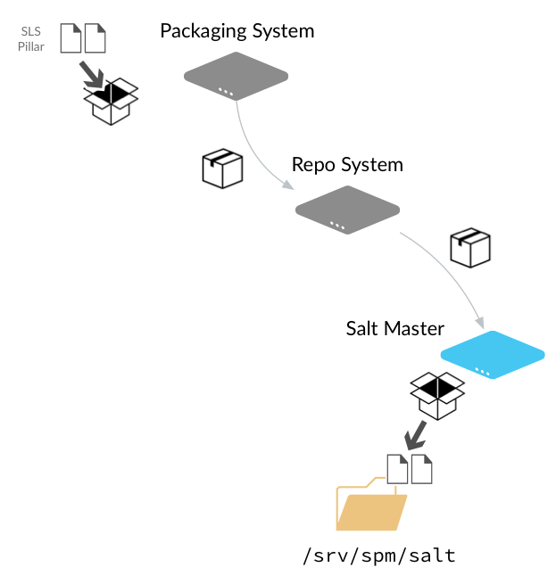
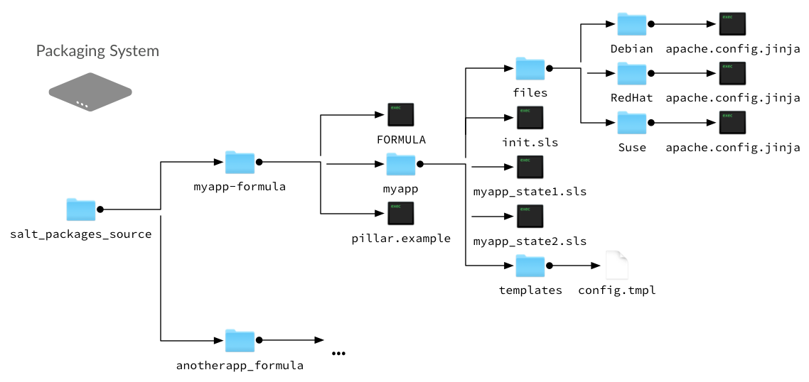
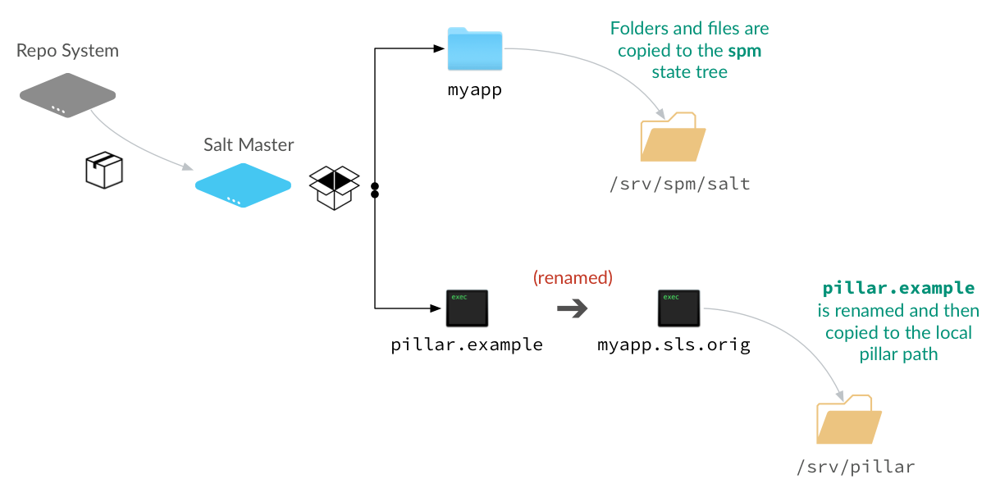

# SALT PACKAGE MANAGER
*Status:  Technical Review*

Salt Package Manager（前端管理命令是SPM），允许打包Salt formulas以简化Salt master服务器的分发操作。 SPM的设计受到其他现有包管理系统的影响，包括RPM，Yum和Pacman。



> 注意：上图将每个SPM组件显示为不同的系统，但这不是必需的。 如果你愿意，可以在单个Salt master上构建软件包并托管SPM存储库。

**内容索引**

+ [Building SPM Packages](#Building-SPM-Packages)
    - Package Build Overview
    - Package Installation Overview
    - Building an SPM Formula Package
    - Types of Packages
    - Technical Information
    - SPM-Specific Loader Modules
+ [Distributing SPM Packages](#Distributing-SPM-Packages)
    - Setting up a Package Repository
    - Adding a Package to the repository
    - Generate Repo Metadata
+ [Installing SPM Packages](#Installing-SPM-Packages)
    - Configuring Remote Repositories
    - Update File Roots
    - Installing Packages
    - Pillars
    - Removing Packages
+ [SPM Configuration](#SPM-Configuration)
    - spm_logfile
    - spm_repos_config
    - spm_cache_dir
    - spm_db
    - spm_build_dir
    - spm_build_exclude
    - formula
    - reactor
    - conf
+ [FORMULA File](#FORMULA-File)
    - Required Fields
    - name
    - os
    - os_family
    - version
    - minimum_version
    - release
    - summary
    - description
+ Optional Fields
    - top_level_dir
    - dependencies
    - optional
    - recommended
    - files
    - local States
    - tgt States
    - Templating States
+ [SPM Development Guide](#SPM-Development-Guide)
    - SPM-Specific Loader Modules


## Building SPM Packages
打包系统用于将公式使用的state, pillar, file templates和其他文件打包到单个文件中。 创建formula package后，它将被复制到存储库系统，在那里它供Salt masters服务器使用。

*Status:  Technical Review*

使用Salt Package Manager的第一步是为要分发的每个公式构建安装包。 你可以在任何可以安装Salt的系统上构建软件包。

### PACKAGE BUILD OVERVIEW
要构建程序包，公式使用的所有state，pilla，jinja和文件模板都将组装到构建系统上的文件夹中。 这些文件可以从Git存储库克隆，例如在GitHub上的[saltstack-formula](https://github.com/saltstack-formulas)组织中找到的文件，或直接复制到该文件夹。

下图演示了构建系统上的典型布局：


在此示例中，所有公式文件都放在`myapp-formula`文件夹中。 这是构建此包时`spm build`命令所使用的目标文件夹。

在这个文件夹中，pillar数据放在根目录下的pillar.example文件中，所有state，jinja和模板文件都放在一个以打包的应用程序命名的子文件夹中。 state文件通常包含在子文件夹中，类似于状态树中状态文件的组织方式。 包中未包含在子文件夹中的任何非pillar文件都放在spm状态树的根目录下。

此外，需要创建一个 [FORMULA](#FORMULA-File) 文件并将其放在文件夹的根目录中。 此文件包含SPM使用的包元数据。

### PACKAGE INSTALLATION OVERVIEW
构建包时，了解Salt master上文件的安装位置很有用。 在安装过程中，除了`pillar.example`和`FORMULA`之外的所有文件都直接复制到Salt master（位于\srv\spm\salt）的spm状态树中。

如果根目录中存在`pillar.example`文件，则将其重命名为`<formula name>.sls.orig`并放在`pillar_path`中。



> 注意：即使将pillar数据文件复制到pillar root，仍然需要使用pillar top file将该pillar数据分配给系统。 此文件也可以复制和重命名，保持`.orig`版本内容不变，以备日后需要恢复时使用。

### BUILDING AN SPM FORMULA PACKAGE
1. 将formula文件组装到构建系统上的文件夹中。
2. 创建一个FORMULA文件并把它放在上面文件夹的根目录下。
3. 运行`spm build <folder name>`， 安装包在构建完成后会存放到 `/srv/spm_build folder`路径下。
```bash
spm build /path/to/salt-packages-source/myapp-formula
```
4. 将`.spm` 文件复制到存储库系统中。

### TYPES OF PACKAGES
SPM支持多种类型的包。 每个包的名称也表明了其功能。 例如，以`-formula`结束的包被认为是Salt States（最常见的formula类型）。 以`-conf`结尾的包包含要放在`/etc/salt/`目录中的配置。 不包含以上名称后缀的包会被视为等同于具有`-formula`的名称。

**FORMULA**

默认情况下，这一类型的安装包中的大多数文件都位于`/srv/spm/salt/`目录中。只有 `pillar.example`文件例外，它将重命名为`<package_name>.sls`并放在pillar目录中（默认情况下为/srv/spm/pillar/）。

**REACTOR**

默认情况下，这一类型的安装包中的大多数文件都位于 `/srv/spm/reactor/` 目录中。

**CONF**

此类软件包中的文件是Salt的配置文件，通常位于`/etc/salt`/目录中。 原则上，Salt之外的程序包使用的配置文件建议使用Salt State（也就是使用`formula`类型的包）进行处理。

### TECHNICAL INFORMATION
软件包是使用BZ2压缩的tarball构建的。 默认情况下，使用sqlite3驱动程序存储包数据库（请参阅下面的Loader Modules）。

对这些内容的支持是内置于Python中的，因此不需要外部依赖项。

属于SPM的所有其他文件都使用YAML，以实现可移植性，易用性和可维护性。

### SPM-SPECIFIC LOADER MODULES
SPM的设计与传统的包管理器相似，后者将文件应用于文件系统并将包元数据存储在本地数据库中。 但是，由于现代基础架构通常超出了这些用例，因此SPM的某些部分已经分解为它们自己的模块集。

**PACKAGE DATABASE**

默认情况下，使用sqlite3模块存储包数据库。 选择此模块是因为对SQLite3的支持是内置于Python本身的。

有关为包数据库管理创建新模块的信息，请参阅“SPM开发指南”。

**PACKAGE FILES**

默认情况下，使用`local`模块安装包文件。 此模块将文件部署于安装软件包的计算机上的本地文件系统。

有关为软件包的文件管理创建新模块的说明信息，请参阅 [SPM开发指南](#SPM-Development-Guide)。


## Distributing SPM Packages
*Status:  Technical Review*

Repo系统存储SPM包和元数据文件，并通过http(s)，ftp或file URLs将它们提供给Salt masters服务器。 SPM存储库可以托管在可以安装Salt的任何系统上。 安装了Salt后，可以在更新包或向存储库添加包时运行spm create_repo命令。 SPM repos不需要salt-master，salt-minion或系统上运行的任何其他进程。

> 注意：如果你希望在不能或不想安装Salt的系统上托管SPM存储库，则可以在构建系统上运行spm create_repo命令，然后将包和生成的SPM-METADATA文件复制到存储库。 此外，你还可以直接在Salt master上安装SPM文件，完全绕过存储库。

### SETTING UP A PACKAGE REPOSITORY
包构建完成后，生成的SPM文件将放在`srv/spm_build`文件夹中。

将构建的SPM文件放在存储库服务器上的位置取决于你计划如何将它们提供给Salt masters服务器。

可以通过网络共享`srv/spm_build`文件夹，或将文件复制到FTP或Web服务器。

### ADDING A PACKAGE TO THE REPOSITORY
只需将SPM文件复制到repo文件夹，然后生成repo元数据即可添加新软件包。

### GENERATE REPO METADATA
每次更新或向存储库添加SPM包时，请执行`spm create_repo`命令：
```bash
spm create_repo /srv/spm_build
```
SPM为该目录中的所有包生成存储库元数据，并将其放在文件夹根目录下的SPM-METADATA文件中。 无论存储库元数据是否已存在于该目录中，都需要执行此命令。


## INSTALLING SPM PACKAGES
*Status:  Technical Review*

SPM软件包安装在Salt master中，可以使用Salt的各种包管理功能对minions进行管理。

### CONFIGURING REMOTE REPOSITORIES
在SPM可以正常使用存储库之前，需要做好两件事。 首先，Salt master需要通过配置知道存储库的位置信息。 然后它需要下拉存储库元数据。

**REPOSITORY CONFIGURATION FILES**

通过将每个存储库添加到Salt master服务器上的`/etc/salt/spm.repos.d/spm.repo`文件来配置存储库。 此文件包含存储库的名称以及存储库的链接：
```yaml
my_repo:
  url: https://spm.example.com/
```
对于使用HTTP/HTTPS访问认证的，需要定义认证信息:
```yaml
my_repo:
  url: https://spm.example.com/
  username: user
  password: pass
```
注意做好这个配置文件的访问限制, 建议至少将文件权限设置为0640 。

URL可以使用` http, https, ftp, or file`等协议。
```yaml
my_repo:
  url: file:///srv/spm_build
```

** UPDATING LOCAL REPOSITORY METADATA**

在Salt master上配置存储库后，使用`spm update_repo`命令下载存储库元数据：
```bash
spm update_repo
```
运行update_repo命令后，每个repo都会有一个文件都放在Salt master上的`/var/cache/salt/spm`中。 如果添加存储库但似乎没有成功，请检查此路径以验证是否找到了存储库。

### UPDATE FILE ROOTS
SPM软件包安装在Salt master上的`srv/spm/salt`文件夹中。 需要手动将此路径添加到Salt master上的文件根目录。
```yaml
file_roots:
  base:
    - /srv/salt
    - /srv/spm/salt
```
重启salt-master 服务，以使配置生效。

### INSTALLING PACKAGES
使用`spm install`命令安装软件包：
```bash
spm install apache
```
> 警告：目前，SPM在安装软件包之前不会检查文件是否已存在。 这意味着现有文件将被覆盖而不会发出警告。


**INSTALLING DIRECTLY FROM AN SPM FILE**

还可以使用`spm local install`命令，直接使用本地SPM文件安装SPM软件包：
```bash
spm local install /srv/spm/apache-201506-1.spm
```
当使用`spm local install`命令时，并不需要预先配置好一个SPM存储库。

### PILLARS
如果已安装的软件包中包含Pillar数据，请确保在pillar Top file中将pillar数据和相应的系统建立映射关系。

### REMOVING PACKAGES
可以使用`spm remove command`命令删除之前安装的软件包：
```bash
spm remove apache
```
如果文件已被修改，则不会删除它们。 空目录将被删除。

## SPM Configuration
在salt master的配置文件中有许多特定于SPM的选项。 这些配置项既可以在`master`配置文件中配置，也可以在`SPM`自己的spm配置文件中配置（通常位于`/etc/salt/spm`）。 如果在两个位置都配置，则以`spm文件`优先。 通常，不需要对默认值进行变更。

### SPM_LOGFILE
Default: `/var/log/salt/spm`

### SPM_REPOS_CONFIG
Default: `/etc/salt/spm.repos`

SPM存储库使用此文件进行配置。 还有一个与之对应的目录，以`.d`结尾。 例如，如果文件名是`/etc/salt/spm.repos`，则目录为`/etc/salt/spm.repos.d/`。

### SPM_CACHE_DIR
Default: `/var/cache/salt/spm`

当SPM更新软件包存储库元数据和打包时，它们将被放置在此目录中。 软件包数据库（通常称为`packages.db`）也位于此目录中。

### SPM_DB
Default: `/var/cache/salt/spm/packages.db`

包数据库的位置和名称。 该数据库中存储了系统上安装的所有SPM软件包的名称，属于它们的文件以及这些文件的元数据。

### SPM_BUILD_DIR
Default: `/srv/spm_build`

在需要构建一个软件包时，把构建所使用的各种资源文件放入这个目录中。

### SPM_BUILD_EXCLUDE
Default: `['.git']`

当使用SPM构建包时，它通常会将formula目录中的所有文件添加到包中。 唯有此处列出的文件将从该包中排除掉。 此选项需要使用列表的形式进行指定。
```yaml
spm_build_exclude:
  - .git
  - .svn
```

## FORMULA File
除了公式本身，还必须有一个对包进行描述的`FORMULA`文件。 下面是该文件的一个示例：
```yaml
name: apache
os: RedHat, Debian, Ubuntu, SUSE, FreeBSD
os_family: RedHat, Debian, Suse, FreeBSD
version: 201506
release: 2
summary: Formula for installing Apache
description: Formula for installing Apache
```
### REQUIRED FIELDS
下面是这个配置文件中必须包含的一些配置参数。

**NAME**

包的名称，它将显示在包文件名、存储库元数据和包数据库中。 即使源公式名称中包含`-formula`的后缀，此名称也可能不包含该名称。 例如，在打包`apache-formula`时，名称应设置为`apache`。

**OS**

该公式支持的`os` grain的值。 这用于帮助用户了解哪些操作系统可以支持此软件包。

**OS_FAMILY**

此公式支持的`os_family` grain的值。 这用于帮助用户了解哪些操作系统系列可以支持此软件包。

**VERSION**

包的版本。 虽然由管理此软件包的组织负责，但建议以YYYYMM格式指定此版本。 例如，如果此版本于2015年6月发布，则软件包版本应为201506 。如果在一个月内发布多个版本，还应同时使用`release`字段。

**MINIMUM_VERSION**

Salt使用此公式的最低推荐版本。 目前尚未作为强制要求执行。

**RELEASE**

此字段主要指版本的发布，但也指一个月内的多个版本。 通常，如果某个已公开的版本，需要立即进行更新，则应更新此字段。

**SUMMARY**

一行关于包的描述信息。

**DESCRIPTION**

关于包的详细说明信息，可以多行。

### OPTIONAL FIELDS
下面的配置参数，是可选的。

**TOP_LEVEL_DIR**

此字段是可选的，但强烈建议使用。 如果未指定，将使用包名称。

公式存储库通常不会将`.sls`文件存储在存储库的根目录中; 相反，它们存储在子目录中。 例如，`apache-formula`存储库将包含一个名为`apache`的目录，该目录将包含`init.sls`以及许多其他相关文件。 在这种情况下，`top_level_dir`应设置为`apache`。

`top_level_dir`之外的文件，例如`README.rst，FORMULA`和`LICENSE`将不会被安装。 此规则的例外是已经特殊处理的文件，例如`pillar.example`和`_modules/`。

**DEPENDENCIES**

一个以逗号分隔的软件包列表，作为依赖项与此软件包一起安装。 安装此软件包后，SPM也会尝试发现并安装有依赖关系的软件包。 如果无法执行，则拒绝安装此软件包。

这对于创建将其他包绑定在一起工作的包非常有用。 例如，一个名为`wordpress-mariadb-apache`的软件包将依赖于`wordpress，mariadb`和`apache`。

**OPTIONAL**

一个以逗号分隔的与此包相关的包列表，但不是必需的，也不一定是推荐的。 将程序包安装到SPM时，此列表将显示在参考消息中。

**RECOMMENDED**

一个以逗号分隔的可选包列表，建议随包一起安装。 将程序包安装到SPM时，此列表将显示在参考消息中。

**FILES**

可以添加一个文件的配置段落，以指定要添加到SPM的文件列表。 这样的配置部分可能看起来像：
```yaml
files:
  - _pillar
  - FORMULA
  - _runners
  - d|mymodule/index.rst
  - r|README.rst
```
在配置了指定文件后，无论目录中存在哪些其他文件，也只有这些文件才会添加到SPM。 它们将按指定的顺序添加，如果需要按特定顺序放置文件，这将非常有用。

从上面的示例中可以看出，还可以将文件标记为特定类型。 这是通过预先挂起具有其类型的文件名，然后是管道（`|`）字符来完成的。 上面的示例中包含文档文件和自述文件。 可用的文件类型是：
- c: config file
- d: documentation file
- g: ghost file (i.e. the file contents are not included in the package payload)
- l: license file
- r: readme file
- s: SLS file
- m: Salt module

前面5种类型的文件 (c, d, g, l, r) 将默认地放在 `/usr/share/salt/spm/`目录中。这可以通过`/etc/salt/spm`中的 `spm_share_dir` 配置项进行定义。

基本后的两种类型(s, m)目前还没有做支持，是为日后做的预留。

**PRE AND POST STATES**

通过使用pre和post states，可以在安装包之前和之后运行Salt状态。 以下部分可以在公式中声明：
- pre_local_state
- pre_tgt_state
- post_local_state
- post_tgt_state

在安装软件包之前评估名称中包含`pre`的部分，并在安装软件包之后评估具有`post`的部分。 在`tgt` states之前评估`local` states。

这些部分中的每一部分都需要作为文本进行评估，而不是作为YAML进行评估。 考虑以下配置块：
```yaml
pre_local_state: >
  echo test > /tmp/spmtest:
    cmd:
      - run
```
请注意，此声明中在`pre_local_state`之后使用`>`。 这是一个YAML标记，用于将下一个多行块标记为文本，包括换行符。 在声明`pre`或`post` states时使用此标记非常重要，以便可以正确评估其后面的文本。

**LOCAL STATES**

`local` states是在系统本地进行评估， 这类似于使用`salt-call --local`发出状态运行的命令。 这些命令将在运行`spm`命令的本地计算机上发出，无论该计算机是master还是minion。

`local`states 不需要任何特殊参数，但它们仍然必须使用`>`标记来表示状态被评估为文本而不是数据结构。
```yaml
pre_local_state: >
  echo test > /tmp/spmtest:
    cmd:
      - run
```

**TGT STATES**

`tgt`状态是针对远程目标发布的。 这类似于使用`salt`命令发出的状态管理命令。 因此，它要求运行`spm`命令的机器是Salt master主机。

因为`tgt`状态要求指定目标，所以它们的代码块有点不同。 看以下状态：
```yaml
pre_tgt_state:
  tgt: '*'
  data: >
    echo test > /tmp/spmtest:
      cmd:
        - run
```
使用`tgt`状态，状态数据位于`*_tgt_state`代码块内的`data`部分下。 目标当然被指定为`tgt`，此外也可以选择指定`tgt_type`（默认为`glob`）。

仍然需要使用`>`标记，但这次它是针对`data`行配置，而不是`* _tgt_state`这一行。


**TEMPLATING STATES**

状态数据必须作为文本而不是数据结构进行评估的原因是，因为状态数据首先通过渲染引擎进行处理，就像使用标准状态运行一样。

这意味着你可以在Salt中使用Jinja或任何其他受支持的渲染器。 渲染器可以使用所有公式变量，因此如果需要，你可以在state内引用FORMULA数据：
```yaml
pre_tgt_state:
  tgt: '*'
  data: >
     echo {{ name }} > /tmp/spmtest:
      cmd:
        - run
```
也可以在FORMULA中声明自己的变量。 如果SPM无法识别它们，那么它将忽略它们，因此除了避免使用保留字之外，对变量名称没有限制。

默认情况下，渲染器设置为jinja|yaml。 可以通过更改FORMULA本身中的渲染器设置来更改此设置。


**BUILDING A PACKAGE**

创建FORMULA文件后，将其放入要转换为包的公式的根目录中。 `spm build`命令用于将该公式转换为包：
```bash
spm build /path/to/saltstack-formulas/apache-formula
```
包构建结果会存放于构建目录中，默认地，这个目录位于 `/srv/spm/`。

**LOADER MODULES**

当把一个execution module放在master上的`<file_roots>/_ modules/`中时，下次执行同步操作时，它将自动同步到minions。 其他模块也以这种方式传播：state模块可以放在`_states/`中，依此类推。

当SPM检测到位于其中一个目录中的程序包中的文件时，该目录将放在`<file_roots>`中，而不是放在公式目录中和其余文件在一起。


## SPM Development Guide
本文档讨论了SPM二次开发的方法。

### SPM-SPECIFIC LOADER MODULES
SPM was designed to behave like traditional package managers, which apply files to the filesystem and store package metadata in a local database. However, because modern infrastructures often extend beyond those use cases, certain parts of SPM have been broken out into their own set of modules.

Each function that accepts arguments has a set of required and optional arguments. Take note that SPM will pass all arguments in, and therefore each function must accept each of those arguments. However, arguments that are marked as required are crucial to SPM's core functionality, while arguments that are marked as optional are provided as a benefit to the module, if it needs to use them.

SPM的设计与传统的包管理器相似，后者将文件存放于文件系统并将包元数据存储在本地数据库中。 但是，由于现代基础架构通常超出了这些用例场景，因此SPM的某些部分已经拆分为它们自己的模块集。

每个接受参数的函数都有一组必需参数和可选参数。 请注意，SPM将传递所有参数，因此每个函数必须接受每个参数。 但是，标记为必需的参数对SPM的核心功能更加重要，而标记为可选的参数可以在需要时使用它们。

#### PACKAGE DATABASE
默认地，包数据库是使用sqlite3作为数据库. 选用这个模块的原因是，该模块是内建于Python中的。

用于管理包数据库的模块存储在`salt/spm/pkgdb/`目录中。 有一些功能函数是用来支持数据库管理的。

**INIT()**

获取数据库连接，并在必要时初始化包数据库。

此函数不接受任何参数。 如果使用支持连接对象的数据库，则返回该连接对象。 例如，sqlite3模块从sqlite3库返回一个connect()对象：
```python
conn = sqlite3.connect(__opts__['spm_db'], isolation_level=None)
...
return conn
```
SPM本身不会使用此连接对象; 它将按原样传递给模块中的其他函数。 因此，在设置此对象时，请确保以易于在整个模块中使用的方式执行此操作。

**INFO()**

返回包的信息。 这通常包含存储在包中`FORMULA`文件中的信息。

按顺序传入的参数是`package`（必需）和`conn`（可选）。

`package`是包的名称，如`FORMULA`中所指定。 `conn`是从`init()`返回的连接对象。

**LIST_FILES()**

返回已安装软件包的文件列表。 只返回文件名，没有其他信息。

按顺序传入的参数是`package`（必需）和`conn`（可选）。

`package`是包的名称，如`FORMULA`中所指定。 `conn`是从`init()`返回的连接对象。

**REGISTER_PKG()**

在包数据库中注册包。 此功能不会返回任何内容。

按顺序传入的参数是`name`（必需），`formula_def`（必需）和`conn`（可选）。

`name`是包的名称，如`FORMULA`中所指定。 `formula_def`是`FORMULA`文件的内容，作为`dict`。 `conn`是从`init()`返回的连接对象。

**REGISTER_FILE()**

在包数据库中注册文件。 此功能不会返回任何内容。

传入的参数是`name`（必需），`member`（必需），`path`（必需），`digest`（可选）和`conn`（可选）。

`name`是包的名称。

`member`是包文件的一个`tarfile`对象。 它包含在内，因为它包含文件的大部分信息。

`path`是本地文件系统上文件的位置。

`digest`是文件的SHA1校验和。

`conn`是从`init()`返回的连接对象。

**UNREGISTER_PKG()**

从包数据库中取消注册包。 这通常只涉及从数据库中删除包的记录。 此功能不会返回任何内容。

按顺序传入的参数是`name`（必需）和`conn`（可选）。

`name`是包的名称，如`FORMULA`中所指定。 `conn`是从`init()`返回的连接对象。

**UNREGISTER_FILE()**

从包数据库中取消注册文件。 这通常只涉及从数据库中删除文件的记录。 此功能不会返回任何内容。

**DB_EXISTS()**

检查包数据库是否已存在。 这是包数据库文件的路径。 此函数将返回`True`或`False`。

唯一可以预期的参数是`db_`，它是包数据库文件。

#### PACKAGE FILES
默认情况下，使用`local`模块安装包文件。 此模块将文件部署于安装软件包的计算机上的本地文件系统。

用于管理包文件的模块存储在`salt/spm/pkgfiles/`目录中。 还需要一些其他的功能函数才能支持文件管理功能。

**INIT()**

初始化包文件的安装位置。 通常这些将是目录路径，但可以使用其他外部目标，例如数据库。 因此，此函数将返回一个连接对象，该对象可以是数据库对象。 但是，在默认`local`模块中，此对象是包含路径的`dict`。 该对象将被传递到所有其他函数中。

三个目录用于目标：`formula_path，pillar_path和``reactor_path`。

`formula_path`是将要安装的大多数文件的位置。 默认值特定于操作系统，但通常为`/srv/salt/`。

`pillar_path`是将安装`pillar.example`文件的位置。 默认值是特定于操作系统的，但通常是`/srv/pillar/`。

`reactor_path`是将安装reactor文件的位置。 默认值特定于操作系统，但通常为`/srv/reactor/`。

**CHECK_EXISTING()**

检查文件系统中的现有文件。 将检查程序包的所有文件，如果检测到已经存在任何文件，则此函数通常会声明SPM将拒绝安装程序包。

此函数返回系统上存在的文件列表。

传递给此函数的参数依次为：`package`（必需），`pkg_files`（必需），`formula_def`（必需）和conn（可选）。

`package`是要安装的软件包的名称。

`pkg_files`是要检查的文件的列表。

`formula_def`是存储在FORMULA文件中的信息的副本。

`conn`是文件连接对象。

**INSTALL_FILE()**

将一个文件安装到目标（通常在文件系统上）。

此函数返回文件安装到的最终位置。

传递给此函数的参数依次是`package`（必需），`formula_tar`（必需），`member`（必需），`formula_def`（必需）和`conn`（可选）。

`package`是要安装的软件包的名称。

`formula_tar`是包的`tarfile`对象。 传入此方法，以便函数可以为文件调用`formula_tar.extract()`。

`member`是`tarfile`对象，表示单个文件。 在传递给`formula_tar.extract()`之前，可以根据需要对其进行修改。

`formula_def`是FORMULA文件中信息的副本。

`conn`是文件连接对象。

**REMOVE_FILE()**

从文件系统中删除单个文件。 通常这只是一个`os.remove()`。 此功能不会返回任何内容。

传递给此函数的参数依次是`path`（必需）和`conn`（可选）。

`path`是要删除的文件的绝对路径。

`conn`是文件连接对象。

**HASH_FILE()**

返回文件的hexdigest哈希值。

传递给此函数的参数依次是`path`（必需），`hashobj`（必需）和`conn`（可选）。

`path`是文件的绝对路径。

`hashobj`是对`hashlib.sha1()`的引用，用于为文件提取`hexdigest()`。

`conn`是文件连接对象。

此功能的使用通常不会比以下更复杂：
``` python
def hash_file(path, hashobj, conn=None):
    with salt.utils.files.fopen(path, 'r') as f:
        hashobj.update(f.read())
        return hashobj.hexdigest()
```

**PATH_EXISTS()**

检查文件系统上是否已存在该文件。 返回`True`或`False`。

此函数需要`path`参数，该参数是要检查的文件的绝对路径。

**PATH_ISDIR()**

检查指定的路径是否是目录。 返回`True`或`False`。

此函数需要`path`参数，该参数是要检查的绝对路径。
