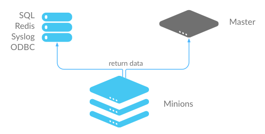

# JOB MANAGEMENT
*New in version 0.9.7.*

由于Salt可以执行在许多系统上运行的作业，因此Salt需要能够管理这些在许多系统上运行的作业。

## THE MINION PROC SYSTEM
Salt Minions在Salt cachedir中维护一个proc目录。 proc目录下维护的是以执行的作业ID命名的文件。 这些文件包含有关minion上当前正在运行的作业的信息，并允许查找作业。 它位于cachedir下的proc目录中，默认配置位于/var/cache/salt/{master|minion}/proc下。

## FUNCTIONS IN THE SALTUTIL MODULE
Salt 0.9.7 版本中为saltutil 模块引入了一些新的jobs管理函数，它们是:
- `running` Returns the data of all running jobs that are found in the proc directory.
- `find_job` 基于指定的job id返回作业运行数据。
- `signal_job` 允许向一个给定 jid 的作业发送一个signal信号。
- `term_job` 向处理特定job任伤的进程发送一个终止任务的信号 (SIGTERM, 15) 。
- `kill_job` 向处理特定job任伤的进程发送一个强行终止任务的信号(SIGKILL, 9) 。

这些功能函数共同组成了管理minion级别jobs的后端功能核心。

## THE JOBS RUNNER
为了提高jobs管理的便利性，开发了一个runner前端和报告子系统。 jobs runner使唤得查看数据更简单、更清晰。

jobs runner 包含了多个功能函数：

### ACTIVE
active函数将对所有minions执行saltutil.running，并使用更加可用和紧凑的格式格式化有关所有正在运行的作业的返回数据。 active函数还将比较已返回的作业和仍在运行的作业，从而更容易查看哪些系统已完成作业以及哪些系统仍在等待。

```bash
# salt-run jobs.active
```

### LOOKUP_JID
执行作业时，返回数据将发送回master服务器并进行缓存。 默认情况下，它会缓存24小时，缓存时长可以通过master配置中的keep_jobs选项进行配置。 所以在缓存有效时间内，使用`lookup_jid` runner可以查看到salt命令初始作业调用所返回数据相同数据。
```bash
# salt-run jobs.lookup_jid <job id number>
```

### LIST_JOBS
在查找一个已经执行过的job之前，可能需要先找到其job ID。 `list_jobs`可以通过解析缓存的执行数据，显示已经或部分返回的作业的所有作业数据。
```bash
# salt-run jobs.list_jobs
```

# SCHEDULING JOBS

Salt的调度系统允许对minions或master进行增量执行。 调度系统对外暴露了执行任务的能力，被执行的对象可以是运行在master上的runner，也可以是在minions上运行的execution功能函数。

可以通过多种方法启用作业调度的功能：
- `schedule`参数，在master 或 minion 配置文件中进行设置。这需要重启master或minion服务使配置生效。
- Minion pillar data，调度功能是通过刷新minion的pillar数据来实现的，例如使用`saltutil.refresh_pillar`。
- [schedule state](https://docs.saltstack.com/en/latest/ref/states/all/salt.states.schedule.html#module-salt.states.schedule) 或 [schedule module](https://docs.saltstack.com/en/latest/ref/modules/all/salt.modules.schedule.html#module-salt.modules.schedule)

> 注意：调度程序在master和minions上分别执行不同的功能。 当在master上运行时，功能函数是引用runner程序，当在minion上运行时，功能函数则被指定为execution函数。

除非将配置设置为信息级别或更高级别，否则通过调度安排运行的作业在minion上不会输出信息。 请参阅`minion-logging-settings`。

正如所有states一样，states在minion上被执行，你可以为其传递位置参数并提供指定名称参数的YAML字典。
```yaml
schedule:
  job1:
    function: state.sls
    seconds: 3600
    args:
      - httpd
    kwargs:
      test: True
```
该调度作业将执行这样的命令: `state.sls httpd test=True` ，间隔3600秒执行一次。
```yaml
schedule:
  job1:
    function: state.sls
    seconds: 3600
    args:
      - httpd
    kwargs:
      test: True
    splay: 15
```
该调度作业将执行这样的命令: `state.sls httpd test=True` ，间隔3600秒执行一次，两次任务之间执行一个0~15秒的延时。
```yaml
schedule:
  job1:
    function: state.sls
    seconds: 3600
    args:
      - httpd
    kwargs:
      test: True
    splay:
      start: 10
      end: 15
```
该调度作业将执行这样的命令: `state.sls httpd test=True` ，间隔3600秒执行一次，两次任务之间执行一个10~15秒的延时。

## SCHEDULE BY DATE AND TIME
*New in version 2014.7.0.*

也可以使用Python dateutil库支持的日期字符串指定作业的执行频率。 这需要安装Python dateutil库。
```yaml
schedule:
  job1:
    function: state.sls
    args:
      - httpd
    kwargs:
      test: True
    when: 5:00pm
```
该调度作业将执行这样的命令: `state.sls httpd test=True` ，在minion上的本地时间5:00PM时执行。
```yaml
schedule:
  job1:
    function: state.sls
    args:
      - httpd
    kwargs:
      test: True
    when:
      - Monday 5:00pm
      - Tuesday 3:00pm
      - Wednesday 5:00pm
      - Thursday 3:00pm
      - Friday 5:00pm
```
该调度作业将执行这样的命令: `state.sls httpd test=True` ，在minion上的本地时间周一、周三、周五的5:00PM执行，在周二、周四的3:00PM执行。
```yaml
schedule:
  job1:
    function: state.sls
    args:
      - httpd
    kwargs:
      test: True
    when:
      - 'tea time'
whens:
  tea time: 1:40pm
  deployment time: Friday 5:00pm
```
Salt调度程序还允许将自定义的惯用语用于when参数。 这些whens可以存储为pillar值或grain值。
```yaml
schedule:
  job1:
    function: state.sls
    seconds: 3600
    args:
      - httpd
    kwargs:
      test: True
    range:
      start: 8:00am
      end: 5:00pm
```
该调度作业将执行这样的命令: `state.sls httpd test=True` ，间隔3600秒执行一次， 在minion本地时间的8:00 AM 到 5:00 PM之间执行。表示时间范围的参数必须是使用 `dateutil` 格式表示的字符串。
```yaml
schedule:
  job1:
    function: state.sls
    seconds: 3600
    args:
      - httpd
    kwargs:
      test: True
    range:
      invert: True
      start: 8:00am
      end: 5:00pm
```
该调度作业将执行这样的命令: `state.sls httpd test=True` ，间隔3600秒执行一次， 在minion本地时间的8:00 AM 到 5:00 PM之外的时间段中执行该作业。表示时间范围的参数必须是使用 `dateutil` 格式表示的字符串。
```yaml
schedule:
  job1:
    function: pkg.install
    kwargs:
      pkgs: [{'bar': '>1.2.3'}]
      refresh: true
    once: '2016-01-07T14:30:00'
```
这将会调度函数pkg.install在指定时间执行一次。 作业完成后，不会删除计划条目job1，因此在作业执行完成后请使用`schedule.delete`手动删除它。

默认日期格式为ISO 8601，但也可以通过指定once_fmt选项来覆盖，如下所示：
```yaml
schedule:
  job1:
    function: test.ping
    once: 2015-04-22T20:21:00
    once_fmt: '%Y-%m-%dT%H:%M:%S'
```

## MAXIMUM PARALLEL JOBS RUNNING
*New in version 2014.7.0.*

调度程序还支持确保运行特定例程时的N个副本不超过N个。 建议将此配置用于那些可能长时间运行的作业，以确保在遇到基础设施服务中断事件时，这些作业不会产生错误的副本。

The default for `maxrunning` is 1.
```yaml
schedule:
  long_running_job:
    function: big_file_transfer
    jid_include: True
    maxrunning: 1
```

## CRON-LIKE SCHEDULE
*New in version 2014.7.0.*

```yaml
schedule:
  job1:
    function: state.sls
    cron: '*/15 * * * *'
    args:
      - httpd
    kwargs:
      test: True
```
调度程序还支持使用类似cron的格式调度作业。 这需要依赖于Python `croniter库。`

## JOB DATA RETURN
*New in version 2015.5.0.*

默认情况下，从Salt调度程序运行的作业的数据将返回到master。 将`return_job`参数设置为False将阻止将数据发送回Salt master。
```yaml
schedule:
  job1:
    function: scheduled_job_function
    return_job: False
```

## JOB METADATA
*New in version 2015.5.0.*

一些使用场景下，使用特定数据来区分一个作业与其他的作业时会很方便。 通过元数据参数，可以为调度作业关联特定的值。 这些值不用于作业的执行，但如果与`return_job`参数结合使用时，就可以在稍后用于搜索特定的作业。 必须将元数据参数指定为字典形式，否则将忽略它。
```yaml
schedule:
  job1:
    function: scheduled_job_function
    metadata:
      foo: bar
```

## RUN ON START
*New in version 2015.5.0.*

默认情况下，根据minion的启动时间安排的任何作业将在minion启动时运行预定作业。 有时这不是理想的情况。 使用设置为`False`的`run_on_start`参数将导致调度程序跳过此第一次运行并等待下一次计划运行：
```yaml
schedule:
  job1:
    function: state.sls
    seconds: 3600
    run_on_start: False
    args:
      - httpd
    kwargs:
      test: True
```

## UNTIL AND AFTER
*New in version 2015.8.0.*
```yaml
schedule:
  job1:
    function: state.sls
    seconds: 15
    until: '12/31/2015 11:59pm'
    args:
      - httpd
    kwargs:
      test: True
```

使用until参数，Salt调度程序允许你指定调度 作业的结束时间。 如果指定了此参数，则在指定的时间过后，作业将不会运行。 时间应使用`dateutil`库支持的格式指定。 这需要安装Python `dateutil`库。

```yaml
schedule:
  job1:
    function: state.sls
    seconds: 15
    after: '12/31/2015 11:59pm'
    args:
      - httpd
    kwargs:
      test: True
```
使用after参数，Salt调度程序允许你指定调度作业的开始时间。 如果指定了此参数，则在指定的时间过去之前，作业将不会运行。 时间应以`dateutil`库支持的格式指定。 这需要安装Python `dateutil`库。

## SCHEDULING STATES
```yaml
schedule:
  log-loadavg:
    function: cmd.run
    seconds: 3660
    args:
      - 'logger -t salt < /proc/loadavg'
    kwargs:
      stateful: False
      shell: /bin/sh
```

## SCHEDULING HIGHSTATES
要设置一个每隔60分钟在minion上运行一个highstate，在minion配置或pillar中设置它：
```yaml
schedule:
  highstate:
    function: state.highstate
    minutes: 60
```
时间间隔的单位可以使用 seconds, minutes, hours, 或 days 。

## SCHEDULING RUNNERS
支持在master配置文件指定允许使用哪些Runner executions:
```yaml
schedule:
  run_my_orch:
    function: state.orchestrate
    hours: 6
    splay: 600
    args:
      - orchestration.my_orch
```
上述配置类似于每6小时运行`salt-run state.orch orchestration.my_orch`。


## SCHEDULER WITH RETURNER
调度程序对于收集有关minion的监视数据等任务时也很有用，此调度选项将收集状态数据并将其发送到MySQL runner：
```yaml
schedule:
  uptime:
    function: status.uptime
    seconds: 60
    returner: mysql
  meminfo:
    function: status.meminfo
    minutes: 5
    returner: mysql
```
由于逐个指定runner的操作可能会很繁琐，因此`schedule_returner`选项可用于指定一个或一个returners列表，供minions做全局性使用。


# MANAGING THE JOB CACHE
Salt Master为所有执行的作业维护一份缓存数据，可以通过作业运行程序查询。 此作业缓存称为默认作业缓存。

## DEFAULT JOB CACHE
配置作业缓存时可以使用许多选项。 默认缓存系统使用Salt Master上的本地存储，这可以在作业缓存目录中找到（在Linux系统上，通常是`/var/cache/salt/master/jobs`）。 默认缓存系统适用于大多数部署，它通常不需要任何进一步的配置或管理。

默认作业缓存是临时性的缓存，作业将被存储24小时。 如果默认缓存需要存储不同时间段的作业，则可以通过更改Salt Master配置文件中的`keep_jobs`参数来调整时间。 传入的值是以小时为单位：
```yaml
keep_jobs: 24
```

### REDUCING THE SIZE OF THE DEFAULT JOB CACHE
默认作业缓存配置有时会成为大型部署场景中（超过5000个minions时）的负担。 但禁用作业缓存则又将使得不可查询以前执行过的作业信息，所以通常不建议这样做。 一般来说，为master设备配置使用有更快的IO能力的系统或者将jobs目录挂载为一个tmpfs文件系统是明智的选择。

但是，你仍然可以通过在Salt Master配置文件中将其设置为`False`来禁用`job_cache`。 将此值设置为False意味着Salt Master将不再缓存minion返回的作业数据，不过仍将会创建每个作业的JID目录和`jid`文件，因为此JID目录是检查和防止JID冲突所必需的。

作业缓存的默认位置位于`/var/cache/salt/master/jobs/`目录中。

在Salt Master配置文件中将`keep_jobs`选项设置为较小的值（例如1）之外，以及将`job_cache`设置为`False`以减小默认作业高速缓存的大小，都可以达到减轻Salt Master的负担的效果。

> 注意：在更改`keep_jobs`选项设置保留旧作业信息的时长时，即使希望使缓存清理程序更频繁地运行，也不要将此值设置为0，因为这意味着缓存清理程序永远不会运行。


## ADDITIONAL JOB CACHE OPTIONS
在许多部署场景中可能希望使用外部数据库来为那些已执行的作业维护一份更加长期的数据存储服务。 Salt有两个主要的机制来实现这一点，即master job cache和exteral job cache。

请参阅下一章节 Storing Job Results in an External System。


# STORING JOB RESULTS IN AN EXTERNAL SYSTEM
作业执行后，每个Salt Minion将作业结果返回给Salt Master。 这些结果存储在` Default Job Cache`中。

除了默认作业缓存之外，Salt还提供了两种额外的机制来将作业结果发送到其他系统（数据库，本地系统日志和其他系统）：
- External Job Cache
- Master Job Cache

这两种机制之间的主要区别在于返回结果来自Salt Master还是Salt Minion。 配置为这两个选项之一时还将使得[Jobs Runner functions](https://docs.saltstack.com/en/latest/ref/runners/all/salt.runners.jobs.html#module-salt.runners.jobs)自动查询远程存储服务以获取信息。

## EXTERNAL JOB CACHE - MINION-SIDE RETURNER
配置为External Job Cache后，数据会像往常一样返回给Salt Master上的默认作业缓存，然后再使用Salt Minion上运行的一个Salt returner模块将结果发送给外部作业缓存一份。



- 优点: 存储数据时不会给Salt Master增加额外的负载。
- 缺点: 每个Salt Minion都连接到外部作业缓存，这可能会导致大量连接。 而且需要在所有Salt Minions上做额外的关于returner模块的设置。

## MASTER JOB CACHE - MASTER-SIDE RETURNER
*New in version 2014.7.0.*

你可以通过配置`Master Job Cache`以从Salt Master发送作业结果的数据，而不是在每个Salt Minion上都去配置支持使用外部作业缓存。 在此配置中，Salt Minions像往常一样将数据发送到默认作业缓存，然后Salt Master使用在Salt Master上运行的Salt returner模块将数据发送给外部系统。


- 优点: 负责提供数据存储服务的外部系统只需要提供单个连接即可。 这对于数据库或类似系统来说是首选。
- 缺点: 给Salt Master设备增加了额外的负载。

## CONFIGURE AN EXTERNAL OR MASTER JOB CACHE

### STEP 1: UNDERSTAND SALT RETURNERS
在配置一个作业缓存功能之前，了解下Salt returner模块（“返回者”）是非常有必要的。 Returners是可插入的Salt Modules，它接收作业返回的数据，然后执行任何必要的步骤将数据发送到外部系统。 例如，returners可以建立连接、进行身份验证，然后格式化和传输数据。

Salt Returner系统提供了External/Master Job Cache systems系统需要使用的核心功能，两个系统使用相同的returners 。

Salt目前提供了许多不同的returners ，可以让你连接到各种系统。 可以从这里[ all Salt returners](https://docs.saltstack.com/en/latest/ref/returners/all/index.html#all-salt-returners)获得一个关于目前支持的所有Salt returners的完整列表。 每个returner的配置都不同，因此请务必阅读并遵循该页面链接的说明。

例如, the MySQL returner 需要满足以下条件:
- 使用提供的schema创建一套数据库和表（库表的创建脚本可以从 [MySQL returner](https://docs.saltstack.com/en/latest/ref/returners/all/salt.returners.mysql.html#module-salt.returners.mysql) 页面获取）
- 创建一个具有数据库使用权限的用户
- SSL配置是可选的

使用一个像是 Slack或HipChat 这样的简单returner, 需要满足下面的条件:
- 一个 API key/version
- 目标 channel/room
- 用来发送消息的用户名称

### STEP 2: CONFIGURE THE RETURNER
了解了配置方法并准备好了外部系统（提供更长期的作业数据存储服务）后，就可以着手配置自己希望使用的外部缓存系统服务了。

**EXTERNAL JOB CACHE**

Returners的配置信息设置可以在Salt Minion的配置文件、Minion的pillar数据或Minion的grains中进行声明。

如果在多个位置都指定了`external_job_cache`配置信息，则按以下顺序检索配置选项。第一个找到的配置信息位置是将要使用的位置。
- Minion configuration file
- Minion's grains
- Minion's pillar data

**MASTER JOB CACHE**

Master Job Cache的returners配置信息设置，则是在Salt Master的配置文件中声明。

**配置文件示例**

MySQL requires:
```yaml
mysql.host: 'salt'
mysql.user: 'salt'
mysql.pass: 'salt'
mysql.db: 'salt'
mysql.port: 3306
```

Slack requires:
```yaml
slack.channel: 'channel'
slack.api_key: 'key'
slack.from_name: 'name'
```

准备好外部存储服务系统并将returner配置信息添加到相应的配置文件后，就可以启用External/Master Job Cache 服务了。

### STEP 3: ENABLE THE EXTERNAL OR MASTER JOB CACHE
启用这个功能只需要增加一行配置信息，用于指定已配置好的returner将所有作业数据发送到外部系统。

**EXTERNAL JOB CACHE**

要启用一个returner为External Job Cache(Minion-side)提供服务时，首先需要将以下行添加到Salt Master配置文件中：
```yaml
ext_job_cache: <returner>
```
例如：
```yaml
ext_job_cache: mysql
```
> 当配置一个External Job Cache（Minion端）服务时，是在Minion配置文件中添加关于returner的配置信息，但是否启用该项功能则要在Master的配置文件中进行设置。

**MASTER JOB CACHE**

要启用一个returner为Master Job Cache(Master-side)提供服务时，首先需要将以下行添加到Salt Master配置文件中：
```yaml
master_job_cache: <returner>
```
例如：
```yaml
master_job_cache: mysql
```
检查一下在Master配置文件中是否包含了启用returner服务所需要的配置信息，并确保在进行配置更改后重新启动salt-master服务。 （service salt-master restart）。
