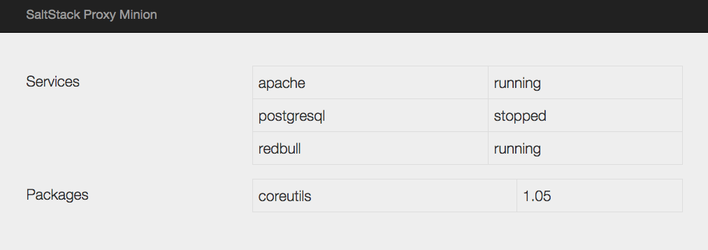

# Salt Proxy Minion End-to-End Example

以下是演示教程，介绍了如何运行一个简单的REST服务以及如何配置一个或多个proxy minions以进行通信和控制。
1. 理想情况下，建议创建一个Python virtualenv并在其中运行REST服务。 这不是严格要求的，但是如果没有virtualenv环境，则需要通过pip在系统上全局安装`bottle`。
2. 克隆 https://github.com/saltstack/salt-contrib 并将目录 `proxyminion_rest_example` 的内容复制到要运行 salt-proxy 的计算机可访问的计算机上的某个位置。 本机系统上需要Python 2.7或更高版本。
3. 通过pip或easy_install安装Bottle版本0.12.8
```bash
pip install bottle==0.12.8
```
4. 运行 `python rest.py --help` 查看帮助信息
5. 使用适当的端口和IP地址启动 REST API 服务。
6. 在浏览器窗口中通过以上IP/port访问该 REST service 的 status page页面 (e.g. http://127.0.0.1:8000) 。
7. 您应该看到一个标题为“Salt Proxy Minion”的页面，其中包含两个部分，一个部分用于“services”，一个部分用于“packages”，并且应该在终端中看到一个日志条目，在其中启动了REST进程，指示已检索到索引页。



接下来，配置你的salt-proxy服务。

1. 编辑 /etc/salt/proxy 文件，增加描述 master 服务的位置信息的设置。
```yaml
master: localhost
```
2. 在salt-master上，确保正确配置了pillar。 为您的代理选择一个ID（在本示例中，我们将使用字母“p”命名该代理，其后跟该代理在其上应答的端口）。 在您的pillar topfile中，为proxy放置一个条目：
```yaml
base:
  'p8000':
    - p8000
```
这表示Salt的pillar应从文件/srv/pillar/p8000.sls加载proxy `p8000`的某些变量值（如果尚未更改默认的pillar_roots）
3. 在base环境的pillar根目录中，创建以下文件p8000.sls：

```yaml
proxy:
  proxytype: rest_sample
  url: http://<IP your REST listens on>:port
```
换句话说, 如果你的 REST service 是监听在 127.0.0.1 地址的 8000 端口， 上面的'url' 键值就应该是: `http://127.0.0.1:8000`
4. 确认你的 salt-master 服务是运行中的。
5. 以debug模式启动 salt-proxy 服务。
```bash
salt-proxy --proxyid=p8000 -l debug
```
6. 在你的 salt-master 服务上接受proxy的认证密钥。
```bash
salt-key -y -a p8000
The following keys are going to be accepted:
Unaccepted Keys:
p8000
Key for minion p8000 accepted.
```
7. 现在您应该能够ping通您的proxy代理了。 在ping时，您应该在运行REST服务的终端中看到一个下面这样的日志条目。
```bash
salt p8000 test.version
```
8. 该REST服务实现了简单的pkg和service provider程序以及少量的grains属性。 要“install”软件包，请使用标准的`pkg.install`。 如果在软件包名称后传递“==”和版本号，则服务将对其进行解析并将其作为软件包的版本。
9. 尝试运行`salt p8000 grains.items`以查看可用的grains。 如果愿意，您可以通过grains信息定位proxies。
10. 您还可以使用`service.start`等启动和停止可用的服务（apache，redbull和postgresql）。
11. 可以写states状态来管理目标proxy，可以放心使用它们。
